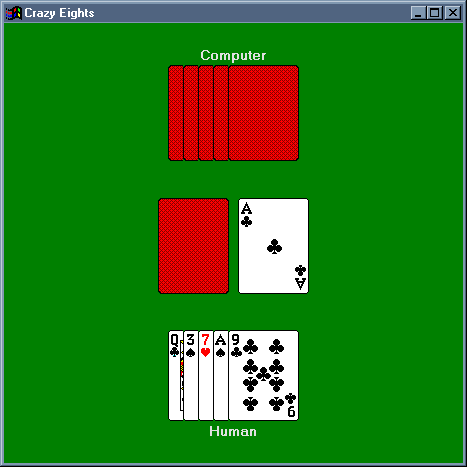



## Card ActiveX Control, Sample CrazyEights Game

### Description

Contains an ActiveX Card control, which is an ideal tool for creating a card game. Proof of that is in the CrazyEights game I also have uploaded. The computer algorighm is guaranteed to beat you some times. It is worth a play.
 
### More Info
 

             |
---                |---
**Submitted On**   |2000-07-17 11:42:44
**By**             |[Jon Feucht](https://github.com/Planet-Source-Code/PSCIndex/blob/master/ByAuthor/jon-feucht.md)
**Level**          |Advanced
**User Rating**    |4.5 (18 globes from 4 users)
**Compatibility**  |VB 3\.0, VB 4\.0 \(16\-bit\), VB 4\.0 \(32\-bit\), VB 5\.0, VB 6\.0, VB Script, ASP \(Active Server Pages\) 
**Category**       |[OLE/ COM/ DCOM/ Active\-X](https://github.com/Planet-Source-Code/PSCIndex/blob/master/ByCategory/ole-com-dcom-active-x__1-29.md)
**World**          |[Visual Basic](https://github.com/Planet-Source-Code/PSCIndex/blob/master/ByWorld/visual-basic.md)
**Archive File**   |[CODE\_UPLOAD78727172000\.zip](https://github.com/Planet-Source-Code/jon-feucht-card-activex-control-sample-crazyeights-game__1-9839/archive/master.zip)

